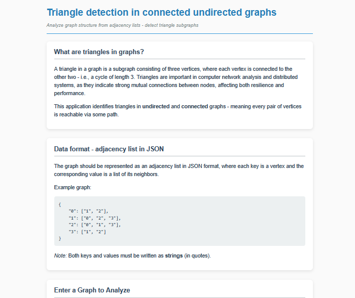
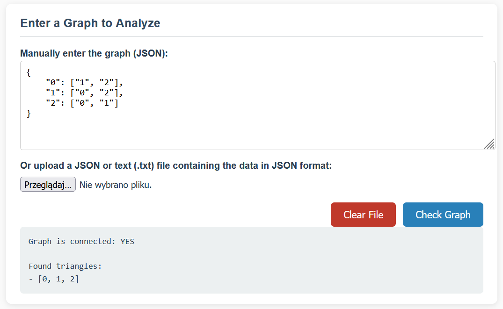
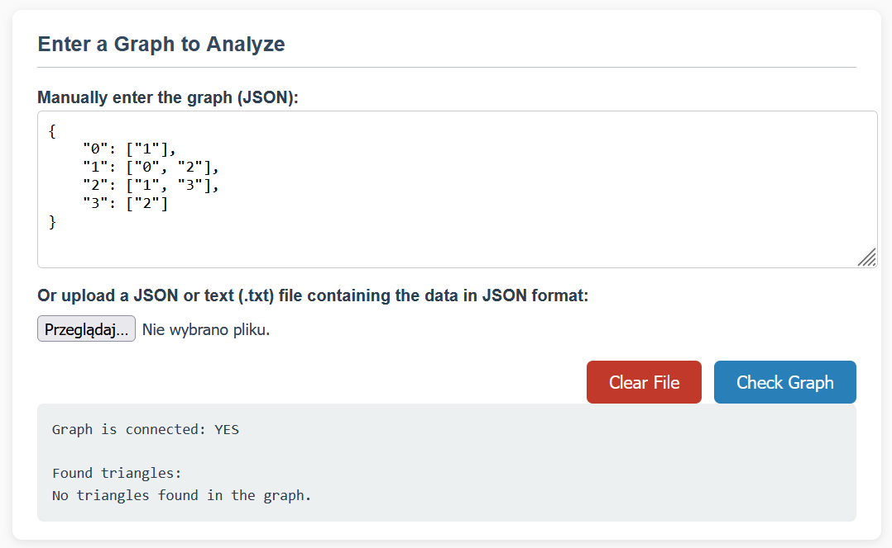
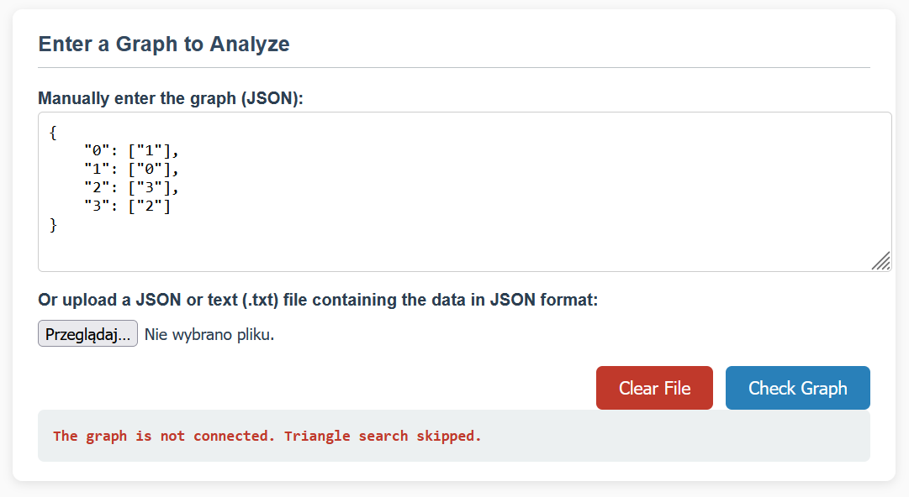

# Triangle Detection in Undirected Graphs

This web application allows you to detect triangles in **undirected and connected graphs** by analyzing an adjacency list provided in JSON format.

It is built using **Flask** for the backend and plain HTML/JavaScript for the frontend.

---

## Features

- Accepts graph input as JSON adjacency lists (strings as keys and values)
- Verifies that the graph is undirected and connected
- Finds and lists all triangles (3-node cycles) within the graph
- Supports manual JSON input or JSON/TXT file upload

---

## Screenshots
<div align="center">
  
| Examples |
|---------|
| **Home Page**<br><p align="center"></p> |
| **Graph with triangles**<br><p align="center"></p> |
| **No triangles**<br><p align="center"></p> |
| **Disconnected graph**<br><p align="center"></p> |
</div>

---

## What is a Triangle in a Graph?

A triangle is a subgraph of three vertices where each vertex is connected to the other two, forming a cycle of length 3. Detecting triangles is useful for analyzing tightly connected clusters in networks.

---

## JSON Input Format

Input the graph as an adjacency list in JSON format, with strings for keys and values, for example:

```json
{
  "0": ["1", "2"],
  "1": ["0", "2", "3"],
  "2": ["0", "1", "3"],
  "3": ["1", "2"]
}
```
---
## Building the executable

This project provides the source code. To generate the standalone `.exe` file yourself, use [PyInstaller](https://www.pyinstaller.org/).

Run the following command in your project directory:

```bash
pyinstaller --add-data "templates;templates" --onefile app.py

